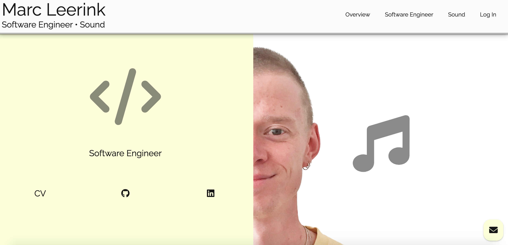

<br />
<p align="center">
  <a href="https://github.com/marcleerink/portfolio_website">
    
  </a>

  <h3 align="center">Portfolio Website</h3>

  <p align="center">
    My personal porfolio website containing my coding and sound projects.
    <br />
    <br />
    <a href="https://marcleerink.herokuapp.com/">View website</a>
    ·
    <a href="https://github.com/marcleerink/portfolio-website/issues">Report Bug</a>
    ·
  </p>
</p>

## About The Project

### Pages
- Landing Page
    - Software Engineer
        - Projects
    - Sound
        - Projects
    - Contact
        - Sign up
        - Log In
        - Profile
        - Contact
### Features
- Login/Authentication
    - Register
    - Login
- Messaging
    - Send message
    - View sent messages
### Built With

- Python/Flask
- JavaScript
- HTML/CSS

## Installation

1. Clone the repo
   ```sh
   git clone https://github.com/marcleerink/portfolio-website.git
   ```
2. Create virtual environment
   Linux/MacOS:
   ```sh
   python3 -m venv venv
   ```
   Powershell:
   ```sh
   py -3 -m venv venv
   ```
3. Activate virtual environment
   Linux/MacOS:
   ```sh
   venv/bin/activate
   ```
   Powershell:
   ```sh
   venv\Scripts\activate
   ```
4. Install dependencies
   ```sh
   pip install -r requirements.txt
   ```
5. Run project
   ```sh
   flask run
   ```

## Contact

Marc Leerink - maleerink@gmail.com

Project Link: [https://marcleerink.herokuapp.com/](https://marcleerink.herokuapp.com/)